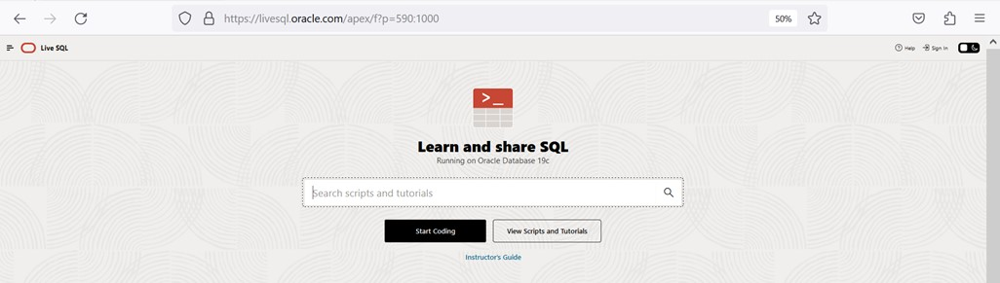
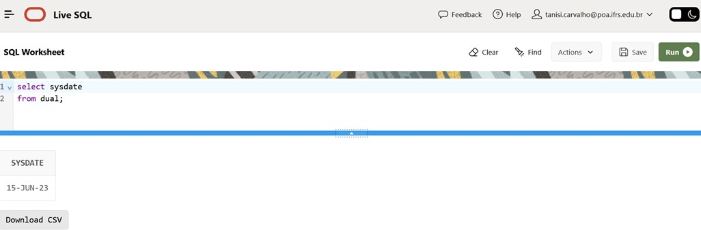

## 1.2 Oracle Live
O Oracle é um dos Sistemas Gerenciadores de Banco de Dados mais utilizados por empresas e instituições de ensino em todo mundo.

O Oracle disponibiliza uma instância do Banco de Dados na núvem, o Oracle Live, para que estudantes possam utilizar este ambiente para aprender SQL (Structured Query Language) e PL/SQL (Procedural Language for SQL).

O Oracle Live pode ser acessado através de um navegador sem a necessidade de instalar qualquer software no computador.

https://livesql.oracle.com/ords/f?p=590:1000

https://signon.oracle.com/signin

Para ter acesso ao ambiente é necessário realizar um cadastro bem simples no site da Oracle.

Todos os códigos apresentados neste curso foram executados e testados no Oracle Live.

