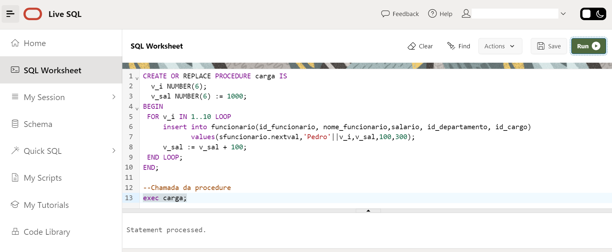

## 2.1 Procedure
Uma procedure é um bloco PL/SQL que possui um nome e uma vez  criada é compilada e fica armazenado no Banco de Dados. Como a procedure fica armazenada no banco de dados, ela pode ser chamada de um programa de aplicação escrito em Python, Java, PHP ou outra linguagem.

A procedure é criada com os comandos CREATE PROCEDURE ou CREATE OR REPLACE PROCEDURE. 

Uma procedure pode ter um ou mais comandos DML (insert, update e delete) e um ou mais comandos SELECT.

A utilização de procedures possui os seguintes benefícios:

Segurança
Maior desempenho
Manutenção                                                                                                                                                                                                                                  
Comando para criar uma procedure

CREATE OR REPLACE PROCEDURE <nome da procedure> [(<variavel> IN <tipo> , <variavel> OUT <tipo>,...., <variavel> IN OUT <tipo>)] IS
[ <variavel> <tipo>,
    ......
   <variavel> <tipo>
]
BEGIN
     <comandos PL_SQL>
END;

Atenção: Pode-se utilizar commit e rollback dentro das procedures/functions.

Importante: A procedure pode ser criada apenas com o create procedure. A utilização do comando create or replace significa que se procedure não existe ela será criada e se já existir é substituída. Em ambiente de desenvolvimento pode-se utilizar o create or replace mas em ambiente de produção recomenda-se utilizar create procedure. 

Comando para eliminar uma procedure
DROP PROCEDURE <nome>;

Exemplo: Criar uma procedure que insere 10 registros na tabela funcionário.

CREATE OR REPLACE PROCEDURE carga IS
  v_i NUMBER(6);
  v_sal NUMBER(6) := 1000;
BEGIN
 FOR v_i IN 1..10 LOOP
 Insert into funcionario(id_funcionario, nome_funcionario,salario, id_departamento, id_cargo) 
    values(sfuncionario.nextval,'Pedro'||v_i,v_sal,100,300);
  v_sal := v_sal + 100;
END LOOP;
 END;

Explicação:

O trecho de código acima é semelhante ao apresentado no módulo anterior quando criamos um bloco PL/SQL anônimo para inserir 10 linhas na tabela funcionário. A diferença está no CREATE OR REPLACE PROCEDURE CARGA que dá um nome ao bloco PL/SQL neste caso, carga. Sendo assim, a procedure será compilada e armazenada no banco de dados e poderá ser chamado posteriormente.

Como chamar a procedure carga: 

1. Utilizando o Execute
 EXECUTE carga;

2. Utilizando o Exec
        EXEC carga;

3. Utilizando o Call
 Call carga();

4. Utilizando um bloco PL/SQL anônimo
Begin
  Carga;
End;

